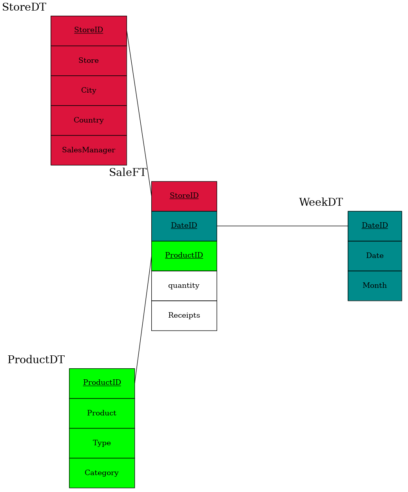
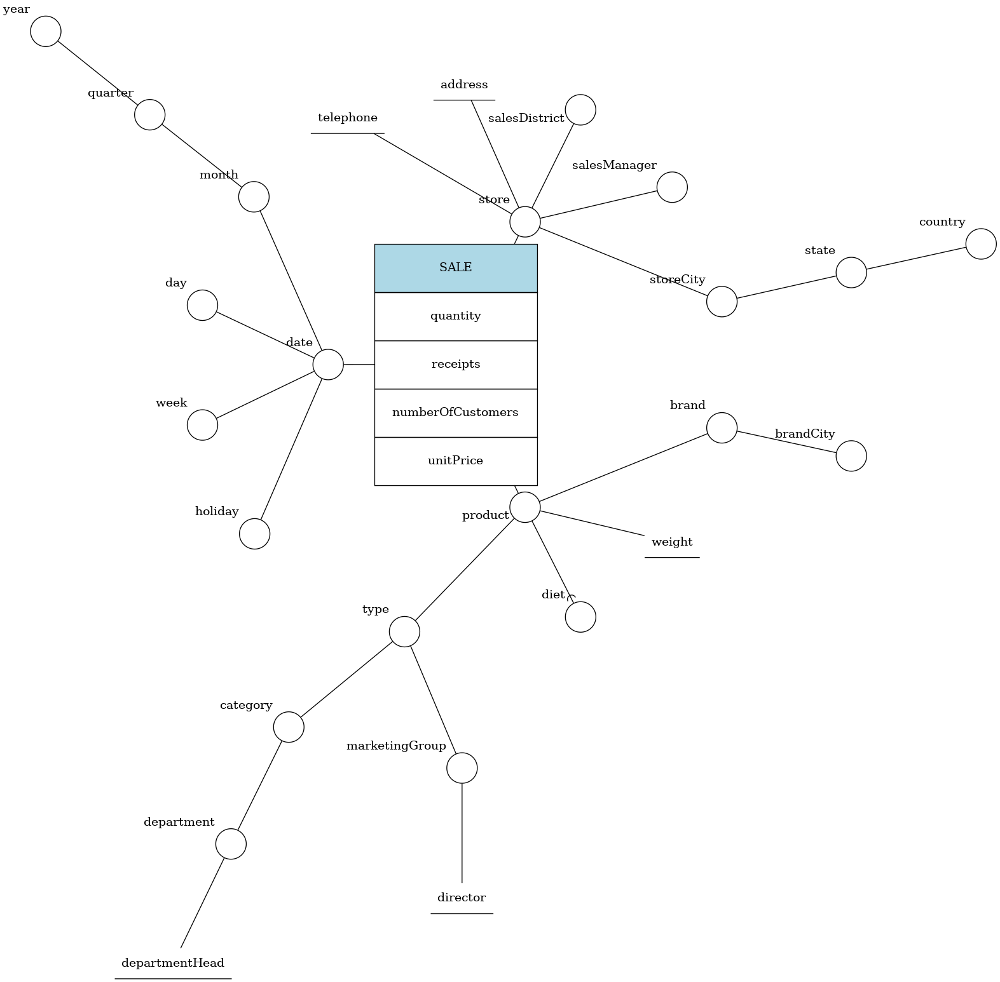
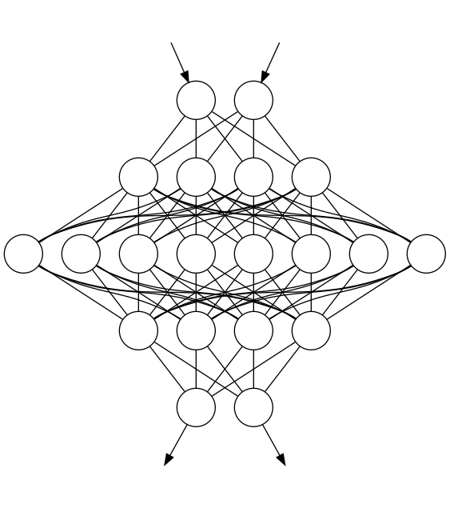

## bubbly

Bubbly is a library written in go that use gographviz to create diagrams by just writing it and not wasting your time by dragging lines and reposition every time by hand all your schema at every modify.


Star schema:


```go
func main() {

	d := diagram.NewSTR()

	SaleFT := d.CreateDimension("SaleFT", "StoreID DateID ProductID", "quantity Receipts")
	
	WeekDT := d.CreateDimension("WeekDT", "DateID", "Date Month")
	StoreDT := d.CreateDimension("StoreDT", "StoreID", "Store City Country SalesManager")
	ProductDT := d.CreateDimension("ProductDT", "ProductID", "Product Type Category")

	d.JoinDimension(SaleFT, WeekDT, "DateID")
	d.JoinDimension(SaleFT, StoreDT, "StoreID")
	d.JoinDimension(SaleFT, ProductDT, "ProductID")

	d.RenderDiagram()
}
```




Dfm schema:


```go
func main() {
	
	d := diagram.NewDFM()

	d.CreateFact("SALE", "quantity receipts numberOfCustomers unitPrice")

	d.AddSequenceDimension("store storeCity state country", "SALE")
	d.AddSequenceDimension("date month quarter", "SALE")
	d.AddSequenceDimension("product type", "SALE")

	d.AddDimension("salesManager", "store")
	d.AddDimension("salesDistrict", "store")
	d.AddSequenceDescriptive("address telephone", "store")

	d.AddDimension("day", "date")
	d.AddDimension("week", "date")
	d.AddDimension("holiday", "date")
	d.AddDimension("year", "quarter")

	d.AddOptional("diet", "product")
	d.AddDescriptive("weight", "product")
	d.AddSequenceDimension("brand brandCity", "product")
	
	d.AddSequenceDimension("category department", "type")
	d.AddDescriptive("departmentHead", "department")
	d.AddDimension("marketingGroup", "type")
	d.AddDescriptive("director", "marketingGroup")

	d.RenderDiagram()
}
```




```go
func main() {
	

	d := diagram.NewNN()

	InputLayer := d.CreateInputLayer("InputLayer", 2)
	
	HiddenLayer1 := d.CreateHiddenLayer("HiddenLayer1", 4)
	HiddenLayer2 := d.CreateHiddenLayer("HiddenLayer2", 82)
	HiddenLayer3 := d.CreateHiddenLayer("HiddenLayer3", 4)
	
	OutputLayer := d.CreateOutputLayer("OutputLayer", 2)

	d.ConnectLayers(InputLayer, HiddenLayer1)
	d.ConnectLayers(HiddenLayer1, HiddenLayer2)
	d.ConnectLayers(HiddenLayer2, HiddenLayer3)
	d.ConnectLayers(HiddenLayer3, OutputLayer)
	
	d.RenderDiagram()
}
```



what bubbly needs to be complete:

DFM:
- [x] convergence
- [x] descriptive attributes
- [x] add fact
- [x] add node   
- [x] optional arc
- [x] hierarchies
- [ ] optional convergence arc
- [ ] optional arc
- [ ] role
- [ ] cycle

STR:
- [x] fact and table
- [x] colors

NN:
- [ ] convolutional nn
- [ ] divide with boxes the layers
- [x] InputLayer
- [x] HiddenLayer
- [x] OutputLayer

other diagrams:
- [x] nn
- [ ] er

optional objectives:
- [ ] parser
- [ ] UI
